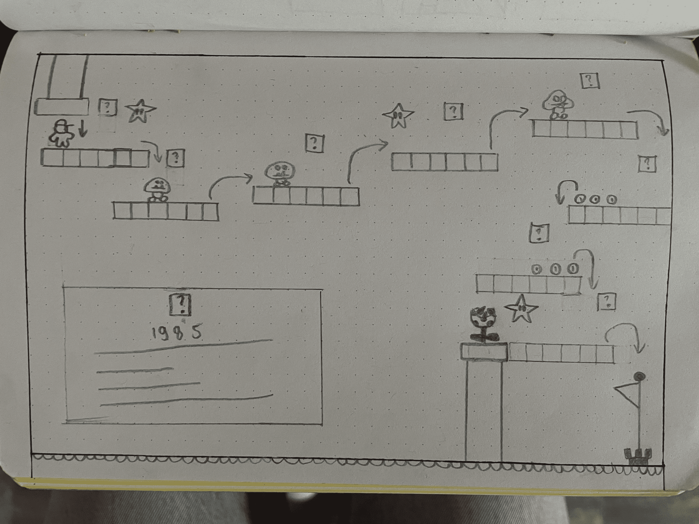
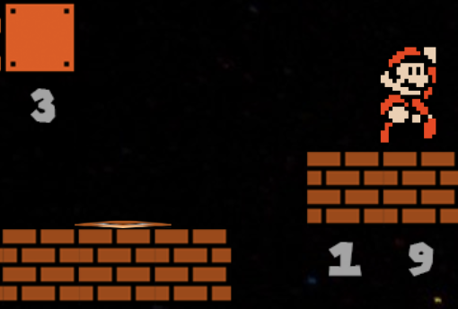
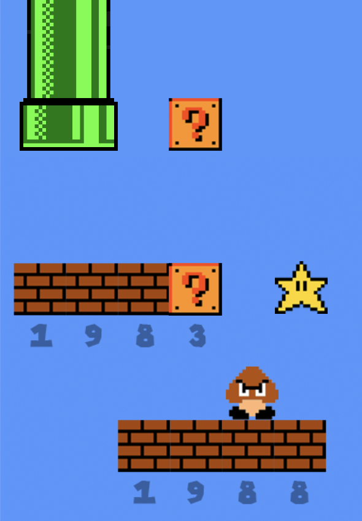
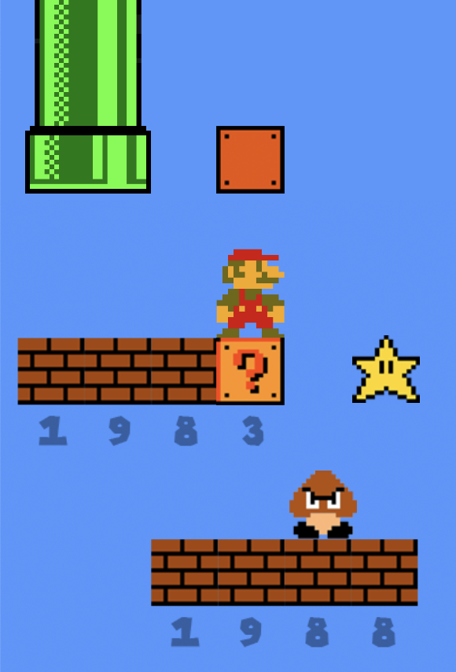
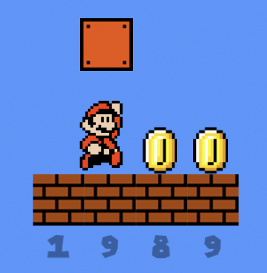

# Procesverslag
Markdown is een simpele manier om HTML te schrijven.  
Markdown cheat cheet: [Hulp bij het schrijven van Markdown](https://github.com/adam-p/markdown-here/wiki/Markdown-Cheatsheet).

Nb. De standaardstructuur en de spartaanse opmaak van de README.md zijn helemaal prima. Het gaat om de inhoud van je procesverslag. Besteedt de tijd voor pracht en praal aan je website.

Nb. Door *open* toe te voegen aan een *details* element kun je deze standaard open zetten. Fijn om dat steeds voor de relevante stuk(ken) te doen.

## Jij

### Ontwerper:
Julia Hop

#### Je startniveau:
Mijn startniveau is: Rood

# Je plan

  
De eerste versie/schets van je ontwerp & je persoonlijke uitdaging

  ### De eerste versie/schets:
  

  ### Je ambitie: 
  Aan deze technieken/punten wil ik werken:
  - Ik wil Mario kunnen laten lopen en springen. (translateX)
  - Ik wil animaties laten afspelen nadat er op een button wordt gedrukt.
  - Ik wil Mario laten krimpen. (scale)
 

## Voortgang/Feedback 1

  
Mijn bevindingen + wijzigingen (minimaal 5)

  ### Bevinding 1:
  Omschrijving van wat er nog niet orde was (tekst en afbeeding(en)).
  
  - Het was nog niet duidelijk of je ook terug in de tijd kon gaan.

  #### oplossing:
  Beschrijving hoe je het hebt hebt opgelost of als het niet gelukt is hoe je het zou oplossen (tekst en afbeeding(en)).

  - Het is opgelost doordat de blokken met een vraagteken erop altijd klikbaar blijven.

  ### Bevinding 2:
  Omschrijving van wat er nog niet orde was (tekst en afbeeding(en)).

  - Het was nog niet duidelijk wat er zou gebeuren als Mario zal vallen.

  #### oplossing:
  Beschrijving hoe je het hebt hebt opgelost of als het niet gelukt is hoe je het zou oplossen (tekst en afbeeding(en)).

  - Het is opgelost doordat Mario niet zelf bestuurt kan worden door de gebruiker (Mario volgt een automatische route).

  ### Bevinding 3:
  Omschrijving van wat er nog niet orde was (tekst en afbeeding(en)).
  - Het was nog niet duidelijk wat er met de Goomba's zou gebeuren als Mario erop zou springen.
  
  
  #### oplossing:
  Beschrijving hoe je het hebt hebt opgelost of als het niet gelukt is hoe je het zou oplossen (tekst en afbeeding(en)).
  - Het is opgelost door de Goomba's platgedrukt te laten liggen nadat Mario erop heeft gesprongen.

  

## Voortgang/Feedback 2

  
Mijn bevindingen + wijzigingen (minimaal 5)

  
  ### Bevinding 1:
  Omschrijving van wat er nog niet orde was (tekst en afbeeding(en)).

  - De pagina was nog niet responsive.

  #### oplossing:
  Beschrijving hoe je het hebt hebt opgelost of als het niet gelukt is hoe je het zou oplossen (tekst en afbeeding(en)).

  - Het is opgelost door de background-image de height te geven van mijn macBook (47.688em).

  ### Bevinding 2:
  Omschrijving van wat er nog niet orde was (tekst en afbeeding(en)).

  - De buttons konden nog niet met het toetsenbord (tab) geselecteerd worden.

  #### oplossing:
  Beschrijving hoe je het hebt hebt opgelost of als het niet gelukt is hoe je het zou oplossen (tekst en afbeeding(en)).

  - Het is opgelost door de img in een button te zetten.

  ### Bevinding 3:
  Omschrijving van wat er nog niet orde was (tekst en afbeeding(en)).

  - Elementen waren nog niet geselecteerd met CSS selectors.

  #### oplossing:
  Beschrijving hoe je het hebt hebt opgelost of als het niet gelukt is hoe je het zou oplossen (tekst en afbeeding(en)).

  - Het is opgelost door alle kleuren en border in CSS selectors te zetten.

## Voortgang/Feedback 3

  
Mijn bevindingen + wijzigingen (minimaal 5)

  
  ### Bevinding 1:
  Omschrijving van wat er nog niet orde was (tekst en afbeeding(en)).

  - Hij is niet helemaal responsive, op een 15 inch laptop zie je een rode achtergrond.

  #### oplossing:
  Beschrijving hoe je het hebt hebt opgelost of als het niet gelukt is hoe je het zou oplossen (tekst en afbeeding(en)).

  - Dit is heel moeilijk om op te lossen, dus daarom is het nu makkelijk opgelost doordat de pagina wegsnijdt als je het venster beweegt.

  ### Bevinding 2:
  Omschrijving van wat er nog niet orde was (tekst en afbeeding(en)).

  - Het is met de toestenbord te bedienen, maar er zijn geen speciale states voor de focus of active state. 

  #### oplossing:
  Beschrijving hoe je het hebt hebt opgelost of als het niet gelukt is hoe je het zou oplossen (tekst en afbeeding(en)).

  - Ik heb expres geen focus en active state toegevoegd, want ik vind de blauwe rand die eromheen komt duidelijk genoeg en anders komt er een kleur over de blokken met het vraagteken erop en dan is het vraagteken niet meer zichtbaar.

  ### Bevinding 3:
  Omschrijving van wat er nog niet orde was (tekst en afbeeding(en)).

  - Ik kan je readme niet beoordelen aangezien die niet is geüpdate.

  #### oplossing:
  Beschrijving hoe je het hebt hebt opgelost of als het niet gelukt is hoe je het zou oplossen (tekst en afbeeding(en)).

  - Ik heb mijn readme geüpdate.

## Reflectie

  
Mijn eindresultaat & persoonlijke ontwikkeling

  ### Je uitkomst - karakteristiek screenshot(s):
  

  ### Dit ging goed/Heb ik geleerd: 
  Korte omschrijving met plaatje(s)

  - Ik heb geleerd hoe je animaties kunt laten afspelen nadat er op een button is geklikt. Ik weet nu dat dit kan door een nieuwe classlist aan te maken in Javascript en dan in css een animatie toe te voegen.
  - Ik heb geleerd hoe je tekst kunt veranderen, namelijk met innerHTML.
  - Ik heb geleerd hoe je plaatjes kunt veranderen, namelijk door de src te veranderen.
  - Ik heb geleerd om te werken met font services.

  
  

  ### Dit was lastig/Is niet gelukt:
  Korte omschrijving met plaatje(s)
  
  - Alles wat ik wilde is gelukt. Natuurlijk kun je het altijd nog uitgebreider maken, zoals bijvoorbeeld een sound effect toevoegen nadat je een coin of ster hebt verzameld of een sound effect wanneer je glijdt van de paal met de vlag. Maar ik denk dat het uitgebreidt genoeg is en dat de tijdlijn past bij Mario, dus ik ben blij met het eindresultaat. 

  

## Bronnenlijst

continu bijhouden terwijl je werkt

Nb. Wees specifiek ('css-tricks' als bron is bijv. niet specifiek genoeg).

1. https://github.com/JuliaHop2003/FvD/blob/main/opdracht2/scripts/index.js
2. https://www.superluigibros.com/evolution-of-mario
3. https://dev.to/ziratsu/switch-to-a-darker-image-when-on-dark-mode-2lkh
4. https://www.dafont.com/super-mario-256.font

